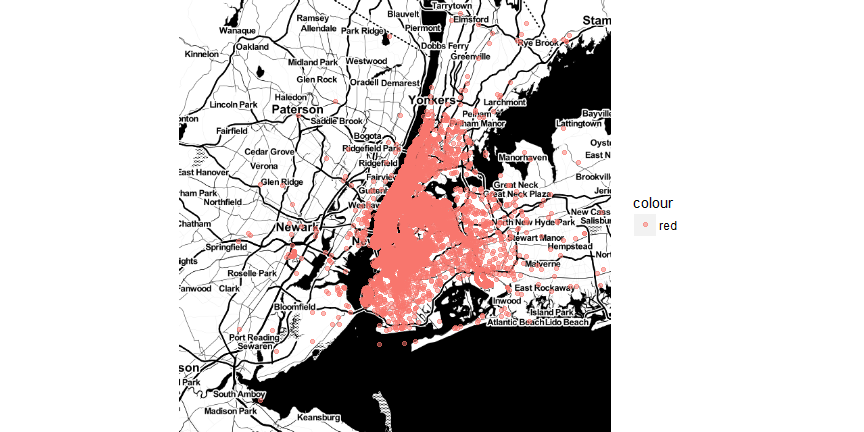
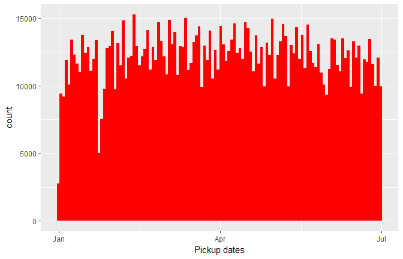
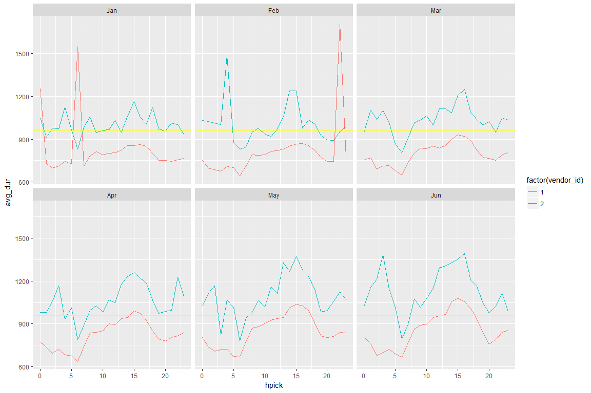
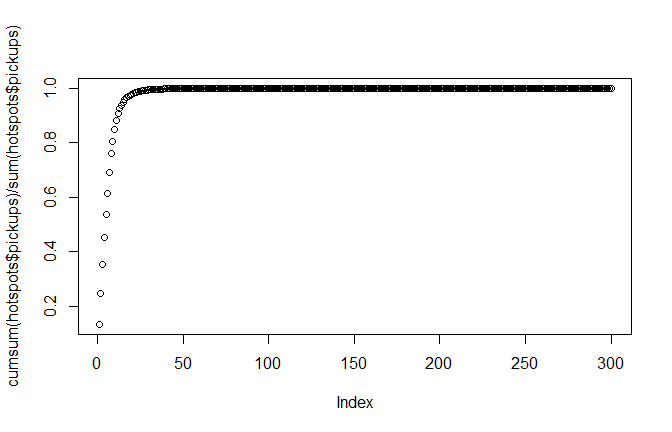
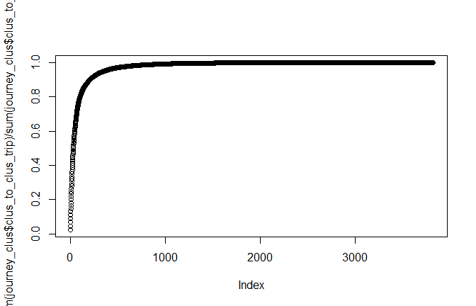

# Introduction
This is a comprehensive Exploratory Data Analysis for the New York City Taxi Trip Duration competition with tidy R and ggplot2.
The goal of this playground challenge is to predict the duration of taxi rides in NYC based on features like trip coordinates or pickup date and time. The data comes in the shape of 1.5 million training observations (../input/train.csv) and 630k test observation (../input/test.csv). Each row contains one taxi trip.
In this notebook, we will first study and visualise the original data, engineer new features, and examine potential outliers. Then we add two external data sets on the NYC weather and on the theoretically fastest routes. We visualise and analyse the new features within these data sets and their impact on the target trip_duration values. Finally, we will make a brief excursion into viewing this challenge as a classification problem and finish this notebook with a simple XGBoost model that provides a basic prediction (final part under construction).


```r
library('ggplot2') # visualisation
library('scales') # visualisation
library('grid') # visualisation
library('RColorBrewer') # visualisation
library('corrplot') # visualisation
library('alluvial') # visualisation
library('dplyr') # data manipulation
library('readr') # input/output
library('data.table') # data manipulation
library('tibble') # data wrangling
library('tidyr') # data wrangling
library('stringr') # string manipulation
library('forcats') # factor manipulation
library('lubridate') # date and time
library('geosphere') # geospatial locations
library('leaflet') # maps
library('ggmap') # maps
library('maps') # maps
library('xgboost') # modelling
library('caret') # modelling
library ('gridExtra') # arrange plots
library("h2o")
library("gganimate")
library("WRS2") #Robust Statistical tests
library("bit64") #for JVM H2O
```
Load data


```r
train <- as.tibble(fread('C:/Users/assad/NYC_Kaggle/train.csv'))
```

File structure and content


```r
summary(train)
```

```
##       id              vendor_id     pickup_datetime    dropoff_datetime  
##  Length:1458644     Min.   :1.000   Length:1458644     Length:1458644    
##  Class :character   1st Qu.:1.000   Class :character   Class :character  
##  Mode  :character   Median :2.000   Mode  :character   Mode  :character  
##                     Mean   :1.535                                        
##                     3rd Qu.:2.000                                        
##                     Max.   :2.000                                        
##  passenger_count pickup_longitude  pickup_latitude dropoff_longitude
##  Min.   :0.000   Min.   :-121.93   Min.   :34.36   Min.   :-121.93  
##  1st Qu.:1.000   1st Qu.: -73.99   1st Qu.:40.74   1st Qu.: -73.99  
##  Median :1.000   Median : -73.98   Median :40.75   Median : -73.98  
##  Mean   :1.665   Mean   : -73.97   Mean   :40.75   Mean   : -73.97  
##  3rd Qu.:2.000   3rd Qu.: -73.97   3rd Qu.:40.77   3rd Qu.: -73.96  
##  Max.   :9.000   Max.   : -61.34   Max.   :51.88   Max.   : -61.34  
##  dropoff_latitude store_and_fwd_flag trip_duration    
##  Min.   :32.18    Length:1458644     Min.   :      1  
##  1st Qu.:40.74    Class :character   1st Qu.:    397  
##  Median :40.75    Mode  :character   Median :    662  
##  Mean   :40.75                       Mean   :    959  
##  3rd Qu.:40.77                       3rd Qu.:   1075  
##  Max.   :43.92                       Max.   :3526282
```

```r
glimpse(train)
```

```
## Observations: 1,458,644
## Variables: 11
## $ id                 <chr> "id2875421", "id2377394", "id3858529", "id3...
## $ vendor_id          <int> 2, 1, 2, 2, 2, 2, 1, 2, 1, 2, 2, 2, 2, 2, 2...
## $ pickup_datetime    <chr> "2016-03-14 17:24:55", "2016-06-12 00:43:35...
## $ dropoff_datetime   <chr> "2016-03-14 17:32:30", "2016-06-12 00:54:38...
## $ passenger_count    <int> 1, 1, 1, 1, 1, 6, 4, 1, 1, 1, 1, 4, 2, 1, 1...
## $ pickup_longitude   <dbl> -73.98215, -73.98042, -73.97903, -74.01004,...
## $ pickup_latitude    <dbl> 40.76794, 40.73856, 40.76394, 40.71997, 40....
## $ dropoff_longitude  <dbl> -73.96463, -73.99948, -74.00533, -74.01227,...
## $ dropoff_latitude   <dbl> 40.76560, 40.73115, 40.71009, 40.70672, 40....
## $ store_and_fwd_flag <chr> "N", "N", "N", "N", "N", "N", "N", "N", "N"...
## $ trip_duration      <int> 455, 663, 2124, 429, 435, 443, 341, 1551, 2...
```

Reformating Data to create hour and month of the trips


```r
train <- train %>%
  mutate(pickup_datetime = ymd_hms(pickup_datetime),
         dropoff_datetime = ymd_hms(dropoff_datetime),
         vendor_id = factor(vendor_id),
         passenger_count = factor(passenger_count))
## Create hpick and Month col
train<-train %>%
  mutate(hpick = lubridate::hour(pickup_datetime),
         Month = factor(lubridate::month(pickup_datetime, label = TRUE)))
head(train)
```

```
## # A tibble: 6 x 13
##          id vendor_id     pickup_datetime    dropoff_datetime
##       <chr>    <fctr>              <dttm>              <dttm>
## 1 id2875421         2 2016-03-14 17:24:55 2016-03-14 17:32:30
## 2 id2377394         1 2016-06-12 00:43:35 2016-06-12 00:54:38
## 3 id3858529         2 2016-01-19 11:35:24 2016-01-19 12:10:48
## 4 id3504673         2 2016-04-06 19:32:31 2016-04-06 19:39:40
## 5 id2181028         2 2016-03-26 13:30:55 2016-03-26 13:38:10
## 6 id0801584         2 2016-01-30 22:01:40 2016-01-30 22:09:03
## # ... with 9 more variables: passenger_count <fctr>,
## #   pickup_longitude <dbl>, pickup_latitude <dbl>,
## #   dropoff_longitude <dbl>, dropoff_latitude <dbl>,
## #   store_and_fwd_flag <chr>, trip_duration <int>, hpick <int>,
## #   Month <ord>
```

# Individual feature visualisations

Visualisations of feature distributions and their relations are key to understanding a data set, and they often open up new lines of inquiry. I always recommend to examine the data from as many different perspectives as possible to notice even subtle trends and correlations.

We start with a map of NYC and overlay a managable number of pickup coordinates to get a general overview of the locations and distances in question.


```r
set.seed(25)
foo <- train[sample(nrow(train), 80000), ]

nyc_map <- get_map(location = c(lat =40.75092, lon = -73.97349),
                   zoom = 10,maptype="toner-2010",source = "stamen")

ggmap(nyc_map,extent = "device") +
  geom_point(aes(x = pickup_longitude, y = pickup_latitude,color="red"), data = foo, alpha = .5)
```

<!-- -->

```r
ggmap(nyc_map,extent = "panel") +
  geom_density2d(aes(x = pickup_longitude, y = pickup_latitude), data = train)+
  stat_density2d(data = train, aes(x = pickup_longitude, y = pickup_latitude, fill = ..level.., alpha = ..level..),size = 0.01, bins = 16, geom = 'polygon')
```

<!-- -->
It turns out that almost all of our trips were in fact taking place in Manhattan only. Another notable hot-spot is JFK airport towards the south-east of the city.


```r
ggmap(nyc_map,extent = "device") +
  geom_point(aes(x = dropoff_longitude, y = dropoff_latitude,color="red"), data = foo, alpha = .5)
```

<!-- -->

```r
ggmap(nyc_map,extent = "panel") +
    stat_density2d(data = train, aes(x = dropoff_longitude, y = dropoff_latitude, fill = ..level.., alpha = ..level..),size = 0.01, bins = 16, geom = 'polygon')
```

<!-- -->
The destination points follow similar patterns to the pickup points. Most of the journey originate and end in the central Manhatton area.


The maps gives us an idea what some of the our distributions could look like. Let's start with plotting the target feature *trip\_duration*:

## Distribution of log of the trip_duartions


```r
ggplot(train,aes(trip_duration,fill=vendor_id))+geom_histogram(bins = 100)+scale_x_log10()
```

<!-- -->

Over the year, the distributions of *pickup\_datetime* and *dropoff\_datetime* look like this:


```r
ggplot(train,aes(pickup_datetime)) +geom_histogram(fill = "red", bins = 120) +  labs(x = "Pickup dates")
```



```r
ggplot(train, aes(dropoff_datetime)) +geom_histogram(fill = "blue", bins = 120) +  labs(x = "Dropoff dates")
```


## Binning of trip_duration
Duartion of the trips range from 1 sec to over 30 days but most of the journeys are under 1 hour. So binning the duration in 5 minute intervals, upto 1 hour, as trip_length-

```r
## Function for trip_duration categorization
duration.cat <- function(x, lower = 0, upper, by = 300,
                    sep = "-", above.char = "+") {

  labs <- c(paste(seq(lower, upper - by, by = by),
                  seq(lower + by - 1, upper - 1, by = by),
                  sep = sep),
            paste(upper, above.char, sep = ""))

  cut(floor(x), breaks = c(seq(lower, upper, by = by), Inf),
      right = FALSE, labels = labs)
}
## Binning using the function
train<-train %>%
  mutate(trip_length = duration.cat(trip_duration,upper=3600))
```
Distribution of trip_length

```r
ggplot(train,aes(trip_length,fill=factor(vendor_id)))+geom_bar()+theme(axis.text.x = element_text(angle = 90, hjust = 1))
```

<!-- -->
Average duration of the trips at diffrent month and hours:


```r
avg_duration=mean(train$trip_duration)
grp_df<-train%>%
          group_by(Month,hpick,vendor_id)%>%
          summarise(avg_dur=mean(trip_duration) )
ggplot(grp_df,aes(hpick,avg_dur,color=factor(vendor_id)))+geom_line()+facet_wrap(~Month)+
  geom_hline(yintercept = avg_duration, color="yellow")
```

<!-- -->
Number of trips at different time of the day:

```r
ggplot(train,aes(hpick,fill=factor(vendor_id)))+geom_histogram(bins = 24)
```

<!-- -->

Vendor 2 taxis have consistently longer average *trip_duration accross most hours in all the months. Trips happening during 10am-5pm are longer than other time for both the vendors. Majority of the trips happen during the last third of the day.

## Passenger count and Vendor vs *trip\_duration*

The next question we are asking is whether different numbers of passengers and/or the different vendors are correlated with the duration of the trip. We choose to examine this issue using a series of boxplots for the *passenger\_counts* together with a *facet wrap* which contrasts the two *vendor\_ids*:


```r
train %>%
  ggplot(aes(passenger_count, trip_duration, color = passenger_count)) +
  geom_boxplot() +
  scale_y_log10() +
  theme(legend.position = "none") +
  facet_wrap(~ vendor_id) +
  labs(y = "Trip duration [s]", x = "Number of passengers")
```


We find:

- Both vendors have short trips without any passengers.

- Vendor 1 has all of the trips beyond 24 hours, whereas vendor 2 has all of the (five) trips with more than six passengers and many more trips that approach the 24-hour limit.

- Between 1 and 6 passengers the median trip durations are remarkably similar, in particular for vendor 2. There might be differences for vendor 1, but they are small (hidden plot; note the logarithmic y-axis).

Comparing the densities of the *trip\_duration* distribution for the two vendors we find that the medians are very similar, whereas the means are likely skewed by vendor 2 containing most of the long-duration outliers:

```r
train %>%
  ggplot(aes(trip_duration, fill = vendor_id)) +
  geom_density(position = "stack") +
  scale_x_log10()
```

```r
train %>%
  group_by(vendor_id) %>%
  summarise(mean_duration = mean(trip_duration),
            median_duration = median(trip_duration))
```

```
## # A tibble: 2 x 3
##   vendor_id mean_duration median_duration
##      <fctr>         <dbl>           <dbl>
## 1         1      845.4382             658
## 2         2     1058.6432             666
```
## Use H2O to cluster the Pickup and Dropoff points to check whther origin or destination has any impact on *trip_duration*.

```r
localH2O = h2o.init(ip = "localhost", port = 54321, startH2O = TRUE)

## Convert R dataframe to H2O df [subset of train with lat and long]
clus_df<-train%>%select(id,pickup_longitude,pickup_latitude)
clus_df_drop<-train%>%select(id,dropoff_longitude,dropoff_latitude)

df_h2o <- as.h2o(clus_df)
df_h2o_drop <- as.h2o(clus_df_drop)

## Cluster pick and drop locations
km<-h2o.kmeans(df_h2o,x=2:3,k=300)
km_drop<-h2o.kmeans(df_h2o_drop,x=2:3,k=300)

pick_clus<-h2o.predict(km,df_h2o)
drop_clus<-h2o.predict(km_drop,df_h2o_drop)

## Incorporate the clusters into train dataframe

pick_clus<-as.data.frame(pick_clus)$predict
drop_clus<-as.data.frame(drop_clus)$predict

train$pick_cluster<-pick_clus
train$drop_cluster<-drop_clus
```

### Check if Pickup location dictates duration


```r
hotspots<-train%>%
            group_by(pick_cluster)%>%
              summarise(pickups=n())%>%arrange(desc(pickups))

plot(cumsum(hotspots$pickups)/sum(hotspots$pickups))
```

<!-- -->
     98% of the pickups have been generated from the top 25 clusters!


```r
top25<-hotspots$pick_cluster[1:25]


clustered_df<-train%>% filter(pick_cluster %in% top25)%>%
                             group_by(pick_cluster,vendor_id,hpick)%>%
                         summarise(avg_duration=mean(trip_duration), no_of_trips=n(),                                      clus_lon=mean(pickup_longitude),clus_lat=mean(pickup_latitude))


ani_p<- ggmap(nyc_map)+geom_point(data=clustered_df,
                        aes(x=clus_lon,y=clus_lat,color=factor(pick_cluster),                                   size=avg_duration,frame=hpick))


gganimate(ani_p,ani.width=700,ani.height=700)
```

<!-- -->

**Check how duration varies from prime locations**


```r
boxplot_df<- train%>% filter(pick_cluster %in% top25 & trip_duration<7200)

ggplot(boxplot_df,aes(factor(pick_cluster),trip_duration,color=factor(vendor_id),frame=hpick))+geom_boxplot()+facet_grid(vendor_id~.)+theme(axis.text.x = element_text(angle = 90, hjust = 1))
```

<!-- -->

It seems average trip_duartion is longer in some Pickup clusters than the others. In the all the clusters, the range of duration varies widely.


**Check if Dropoff location dictates duration**


```r
hotspots_drop<-train%>%
            group_by(drop_cluster)%>%
              summarise(dropoffs=n())%>%arrange(desc(dropoffs))

plot(cumsum(hotspots$pickups)/sum(hotspots_drop$dropoffs))
```

<!-- -->
     Almost like the pickup clusters; 98% of the dropoff happens in the top 22 clusters!

```r
top22<-hotspots_drop$drop_cluster[1:22]

clustered_df<-train%>% filter(drop_cluster %in% top22)%>%
                             group_by(drop_cluster,vendor_id,hpick)%>%
                         summarise(avg_duration=mean(trip_duration), no_of_trips=n(),                                      clus_lon=mean(dropoff_longitude),clus_lat=mean(dropoff_latitude))


ani_p<- ggmap(nyc_map)+geom_point(data=clustered_df,
                                  aes(x=clus_lon,y=clus_lat,                                                                        color=factor(drop_cluster),size=avg_duration,frame=hpick))
```

```
## Warning: Ignoring unknown aesthetics: frame
```

```r
gganimate(ani_p,ani.width=700,ani.height=700)
```

<!-- -->


```r
boxplot_df<- train%>% filter(drop_cluster %in% top22 & trip_duration<7200)

ggplot(boxplot_df,aes(factor(drop_cluster),trip_duration,color=factor(vendor_id)))+geom_boxplot()+facet_grid(vendor_id~.)+theme(axis.text.x = element_text(angle = 90, hjust = 1))
```

<!-- -->


```r
journey_clus<-train%>% group_by(pick_cluster,drop_cluster)%>%
                          summarise(clus_to_clus_trip=n(),journey_time=mean(trip_duration),
                                    pick_lon=mean(pickup_longitude),
                                    pick_lat=mean(pickup_latitude),
                                    drop_lon=mean(dropoff_longitude),
                                    drop_lat=mean(dropoff_latitude))%>%
                          arrange(desc(clus_to_clus_trip))


plot(cumsum(journey_clus$clus_to_clus_trip)/sum(journey_clus$clus_to_clus_trip))
```

<!-- -->

Out of 90,000 (300X300) possible combinations, most of the journey in the dataset takes place in between 600 pair of locations!

**Check if workday or weekend have any impact**


```r
train %>%
      mutate(day_of_week = wday(pickup_datetime, label = TRUE)) %>%
      group_by(day_of_week, vendor_id) %>%
      ggplot(aes(day_of_week, trip_duration, color = vendor_id)) +
      geom_boxplot()+scale_y_log10()
```

<!-- -->


Durationwaise weekdays and weekends are more or less similar, but let's check all our hypothesis and confirm in the following section.

# Statistical Testing of the factors:

## Whether there is a significant diffrence in mean trip_duration between vendors   


```r
t_mean<-t.test(trip_duration~vendor_id,data=train,paired=F)

t_mean
```

```
##
## 	Welch Two Sample t-test
##
## data:  trip_duration by vendor_id
## t = -23.942, df = 1188800, p-value < 2.2e-16
## alternative hypothesis: true difference in means is not equal to 0
## 95 percent confidence interval:
##  -230.6582 -195.7516
## sample estimates:
## mean in group 1 mean in group 2
##        845.4382       1058.6432
```
check effect-size


```r
## Calculate effect-size
sqrt(t_mean$statistic[[1]]^2/(t_mean$statistic[[1]]^2+ t_mean$parameter[[1]]))
```

```
## [1] 0.02195341
```

Robust t-test:

```r
## Test Using a Robust Method

yuen(trip_duration~ vendor_id,data=train,tr=0.1)
```

```
## Call:
## yuen(formula = trip_duration ~ vendor_id, data = train, tr = 0.1)
##
## Test statistic: 11.1116 (df = 1151410), p-value = 0
##
## Trimmed mean difference:  -10.328
## 95 percent confidence interval:
## -12.1498     -8.5062
```


The test confirms that- on average, vendor 2 has longer trip durations.
The result of the trimmed robust test suggests that the large difference in mean is due to extreme values,
but nonetheless the difference is significant in both tests. Although the effect-size is low, r=0.02195341.

## Whether pickup hour makes a significant difference to the journey time
...
...
....
...
...
.

.
...
